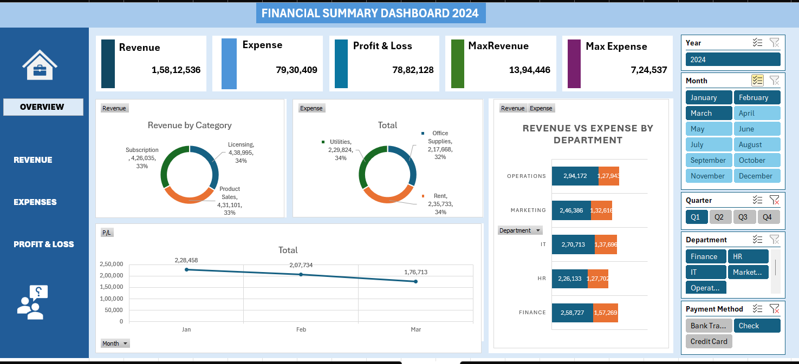
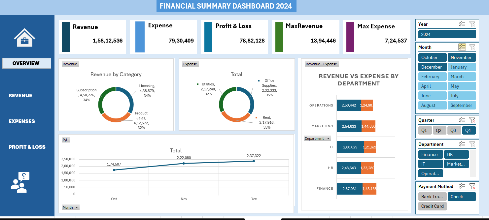

# Financial KPI Dashboard 2024

An interactive Financial KPI Dashboard built in Microsoft Excel to analyze revenue, expenses, profit and loss, department performance, monthly trends, and payment methods using dynamic visualizations and slicers.

---

## Project Overview

This dashboard provides a complete financial performance overview through interactive charts, KPI cards, and filters. It helps users track business financial metrics and generate meaningful insights for decision-making.

The dashboard includes:

- Revenue and expense analysis
- Profit and loss tracking
- Department-wise financial comparison
- Category-wise revenue and expense distribution
- Monthly trend analysis
- Interactive filtering using slicers

---

## Tools and Technologies Used

- Microsoft Excel
- Pivot Tables
- Pivot Charts
- Slicers
- KPI Cards
- Data Visualization
- Dashboard Design

---

## Key Features

- Interactive KPI cards
- Dynamic slicers for year, month, quarter, department, and payment method
- Revenue vs expense comparison
- Monthly profit trend analysis
- Category-wise donut charts
- Professional BI dashboard layout
- Fully interactive financial reporting system

---

## Dashboard Screenshots

### Default Dashboard View


---

### Quarter Q1 Analysis



---

### Quarter Q4 Analysis



---

### Payment Method - Bank Transfer


---

### Payment Method - Credit Card


---

## KPIs Included

- Total revenue
- Total expense
- Profit and loss
- Maximum revenue
- Maximum expense
- Department-wise revenue and expense
- Monthly financial trends

---

## Business Insights Generated

- Identify high-performing departments
- Analyze revenue contribution categories
- Compare payment method performance
- Monitor monthly financial growth trends
- Understand quarterly business performance

---

## Folder Contents

This repository contains the following project files:

- `Financial KPI Dashboard.xlsx` - Final interactive Excel dashboard.
- `Financial Dashboard_Raw Data.xlsx` - Source/raw financial dataset used to build the dashboard.
- `Explanation Video.mp4` - Walkthrough video explaining the dashboard and its insights.
- `Screenshot/` - Dashboard screenshots used in this README.
- `README.md` - Project documentation for GitHub.

---

## Project Structure

```bash
Financial-KPI-Dashboard/
|
|-- Financial KPI Dashboard.xlsx
|-- Financial Dashboard_Raw Data.xlsx
|-- Explanation Video.mp4
|-- README.md
|
`-- Screenshot/
    |-- Screenshot_Default View.png
    |-- Screenshot-2_Q1.png
    |-- Screenshot-2_Q4.png
    |-- Payment via Bank Transfer.png
    `-- Payment via Credit Card.png
```

---

## How to Use

1. Download or clone this repository.
2. Open `Financial KPI Dashboard.xlsx` in Microsoft Excel.
3. Use the slicers to filter the dashboard by year, month, quarter, department, or payment method.
4. Review the KPI cards, charts, and trend visuals to analyze financial performance.

---

## Support

If you found this project helpful, feel free to star the repository.

---

## Author

Developed by Rahul Adhikari  
Data Analyst | BI Analyst | Excel Dashboard Developer
